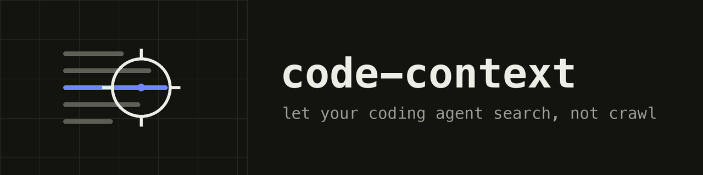
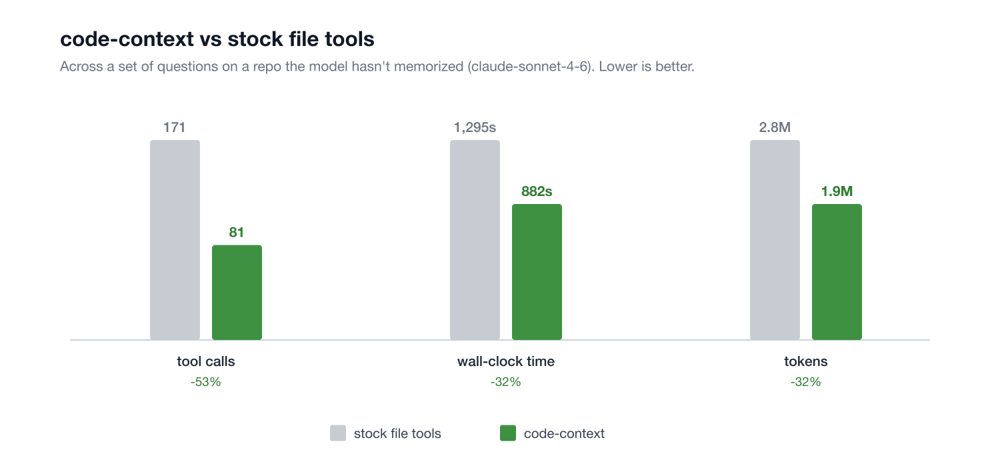

<div align="center">



[](https://github.com/infino-ai/code-context/actions/workflows/ci.yml)
[](https://www.npmjs.com/package/@infino-ai/code-context)
[](LICENSE)
[](https://nodejs.org/)
[](https://deepwiki.com/infino-ai/code-context)

</div>

**code-context** gives AI coding agents ranked search over your codebase
instead of a grep-and-read crawl: a CLI and an MCP server over an index that
lives in plain files inside your repo.

- 🔎 **Find code by words or meaning.** One ranked pass fuses exact keyword
  matching with semantic similarity, and every hit carries the code with
  `path:line` citations.
- 📊 **Ask questions grep can't answer.** Search works as a SQL table
  function, so "which files have the most code about X" is one query:
  ranked by relevance, tallied by `GROUP BY`.
- ⚡ **Searching in seconds, fresh forever.** The keyword index commits
  before the embedding model even finishes downloading, vectors backfill in
  the background, and edits re-sync incrementally: only changed files
  re-chunk and re-embed.
- 🔒 **Nothing leaves your machine.** No accounts, no API keys, no database
  server, no telemetry. Embedding is a small local model, downloaded once;
  after that everything works offline.

Built on [infino](https://github.com/infino-ai/infino), a fast retrieval
engine that runs SQL, full-text search, and vector search over a single copy
of your data. Text and numeric data is stored as spec-compliant Parquet, and
the same engine handles logs, docs, and agent memory.


## Quick start

```
npm install -g @infino-ai/code-context
cd your-repo
cx install && cx index      # keyword search live in seconds on typical repos
```

Or zero-install, straight into Claude Code with one command:

```
claude mcp add code-context -- npx -y @infino-ai/code-context mcp
```

(ask the agent to "index this codebase": the `reindex` tool bootstraps an
unindexed repo in-chat, and search works while indexing runs)

CI-tested on Linux x64 (glibc) and macOS arm64; linux-arm64, musl, and
Windows-via-WSL are expected to work through the engine's prebuilt bindings
but are not CI-covered.

## Evaluation

Real agent runs over a codebase-Q&A suite: same model (claude-opus-4-8),
same turn budget, the same prompt for both lanes, stock file tools
(Glob/Grep/Read/LS) as the baseline. **55% fewer tokens and 71% fewer tool
calls overall**, at answer quality a blind pairwise judge could not tell
apart (8 vs 12 of 20, within noise; details in the benchmark doc).



| Metric | Stock file tools | With code-context | Improvement |
|---|---|---|---|
| Tokens per question | 63.2k | 28.3k | **-55%** |
| Tool calls per question | 7.5 | 2.2 | **-71%** |
| Cost per question | $0.174 | $0.102 | **-41%** |
| Aggregation questions (tokens) | 51.1k | 7.9k | **-85%** |
| Comprehension questions (tokens) | 81.3k | 59.0k | **-28%** |

Full methodology, per-question tables, and a SWE-bench_Verified
localization study are in [docs/benchmark.md](docs/benchmark.md), with the
harness in [`bench/`](bench/) so you can run the same lanes on your own
repo. Where file tools win, the tables say so.

## What you get

One binary (`code-context`, or `cx` for short), one index, and a
deliberately small tool surface for agents:

| Tool | What it does | When agents use it |
|---|---|---|
| `search` | One ranked pass fusing exact keyword matching (BM25) with semantic similarity (reciprocal-rank fusion). Hits carry the chunk content, so answers come straight from results. | Finding code, always: exact identifiers AND paraphrases/renamed symbols in the same call. |
| `sql` | Read-only SQL over the index, including search functions as table-valued relations and `regexp_like` for regex. | Counts, rankings, aggregates over the whole repo in one query. |
| `reindex` | Incremental sync (the server also auto-syncs in the background). | After significant edits. |

Three tools is a deliberate design: one way to find, one way to count, one
way to stay fresh. Every additional near-duplicate retrieval tool worsens an
agent's tool selection, and hybrid search's keyword half already ranks
exact identifier terms highly, so a separate lexical tool has no job left.

### The SQL move

Search-as-a-table composes with aggregation. Ranked by relevance, tallied by
SQL, one engine pass:

```sql
SELECT path, SUM(end_line - start_line + 1) AS lines, COUNT(*) AS chunks
FROM bm25_search('chunks', 'content', 'vector index quantization', 300)
GROUP BY path ORDER BY lines DESC LIMIT 15
```

`hybrid_search(...)` and `vector_search(...)` work the same way. The CLI and
MCP server embed `{{name}}` placeholders server-side, so agents never handle
raw vectors.

### Staged readiness

`cx index` commits the keyword (BM25) index first. On a ~3,000-chunk repo
that takes under a second, so search works before any embedding model even
exists on the machine. Vectors backfill in the background with a local model
(downloaded once, no key; about two minutes for that same repo), and
hybrid/semantic ranking unlocks automatically when they land. If the vector
stage fails, keyword search stays live and the index says so honestly.

The default model optimizes quality-per-minute. See
[docs/embedder-eval.md](docs/embedder-eval.md) for how it was chosen.

### Your index is just files

Everything lives in `.infino/` in your repo root (gitignored by
`cx install`): plain files you can copy, cache in CI, or put on object
storage. It's a live index the engine queries in place, not a snapshot you
export and pass around.

## Setup for agents

`cx install` drops steering into the repo so agents actually use the index:

```
cx install            # Claude Code: project skill + MCP server + status hook; AGENTS.md section
cx install --cursor   # + Cursor rules and MCP config
```

Any MCP client works; the server is stdio.

<details>
<summary><strong>Claude Code</strong></summary>

```bash
claude mcp add code-context -- npx -y @infino-ai/code-context mcp
```

Or run `cx install` in the repo: it registers the server in `.mcp.json` and
adds a project skill plus a session hook that surfaces index freshness.

</details>

<details>
<summary><strong>Cursor</strong></summary>

`cx install --cursor` writes `.cursor/mcp.json` and `.cursor/rules`, or add
manually:

```json
{ "mcpServers": { "code-context": { "command": "npx", "args": ["-y", "@infino-ai/code-context", "mcp"] } } }
```

</details>

<details>
<summary><strong>Codex CLI</strong></summary>

In `~/.codex/config.toml` (note the key is `mcp_servers`):

```toml
[mcp_servers.code-context]
command = "npx"
args = ["-y", "@infino-ai/code-context", "mcp"]
```

</details>

<details>
<summary><strong>Gemini CLI</strong></summary>

In `~/.gemini/settings.json`:

```json
{ "mcpServers": { "code-context": { "command": "npx", "args": ["-y", "@infino-ai/code-context", "mcp"] } } }
```

</details>

<details>
<summary><strong>Windsurf, Cline, and other MCP clients</strong></summary>

Standard stdio MCP config:

```json
{ "mcpServers": { "code-context": { "command": "npx", "args": ["-y", "@infino-ai/code-context", "mcp"] } } }
```

Point the server at a repo explicitly with `env: { "CX_ROOT": "/path/to/repo" }`
when the client's working directory is not the repo.

</details>

Tools: `search`, `sql`, `reindex` (incremental sync: an unchanged repo is
a fast no-op, and the server also auto-syncs in the background as queries
arrive, so results track your edits without anyone asking).

## CLI

```
cx index [path]           sync the index (incremental; --full rebuilds, --watch follows edits)
cx search <query>         exact terms + meaning, one ranked pass           (-k hits)
cx sql <statement>        read-only SQL; --embed q="text" fills {{q}}
cx status                 what the index holds, how fresh, vector readiness
cx mcp                    serve the MCP tools over stdio
cx install                drop agent steering into the repo
```

## Configuration

| Variable | Default | Purpose |
|---|---|---|
| `CX_INDEX_DIR` | `<repo>/.infino` | where the index lives |
| `CX_MAX_FILES` / `CX_MAX_FILE_BYTES` | 20000 / 1MB | indexing caps |
| `CX_ROOT` | current directory | repo root for the MCP server / CLI when not run from the repo |
| `CX_AUTO_SYNC` | on | `0` disables the MCP server's background staleness sync |
| `CX_SYNC_INTERVAL_SECS` | 30 | auto-sync debounce between staleness checks |
| `CX_NO_EMBED` | off | keyword-only mode for the MCP server (skip the vector stage) |

## What it is, and what it isn't

code-context's lane is ranked **content** retrieval and content-relevance
aggregation: find code by words or meaning, rank whole files by how much
they're about a topic, always with `path:line` receipts. It deliberately
does **not** do structural code intelligence (call-graph tracing, dead-code
detection, type resolution). Tools that do are complementary: MCP servers
stack, so run both.

## Architecture

- **Chunking:** tree-sitter (WASM, no native compiles) cuts at definition
  boundaries for TypeScript/JS, Python, Rust, Go, Java, C/C++, Ruby, C#, PHP;
  Markdown splits at headings; everything else falls back to fixed windows.
  Every chunk carries `path, start_line, end_line, lang, content`.
- **Index:** [infino](https://github.com/infino-ai/infino) tables in
  `.infino/`: BM25 (FTS) and IVF vector indexes over a single copy of the
  data, queried in-process through the Node binding. No server.
- **Embeddings:** always local. A small model (chosen by a
  [measured eval](docs/embedder-eval.md)) downloaded once; no key, no
  per-query network, code never leaves the machine. Queries embed with the
  same model the index was built with, and a mismatch is a clear error, not
  silently wrong results.
- **Freshness:** incremental by design. A per-file state map (size/mtime
  prefilter, then content hash) means a sync re-chunks and re-embeds only
  the files that changed: on a ~3,000-chunk repo an unchanged tree checks
  in ~20ms and a one-file edit syncs in ~0.7s with vectors kept current
  (larger-repo numbers in the [benchmark](docs/benchmark.md)). The MCP
  server auto-syncs in the background as queries arrive (never blocking a
  query), `cx index` is incremental by default (`--full` to rebuild), and
  `cx index --watch` syncs on file events.

## License

Apache-2.0
