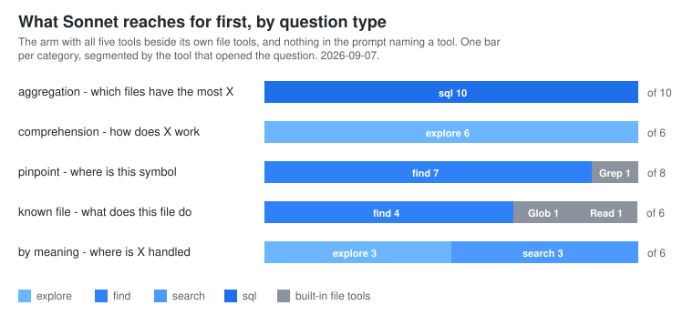

<div align="center">

[](https://github.com/infino-ai/code-context/actions/workflows/ci.yml)
[](https://www.npmjs.com/package/@infino-ai/code-context)
[](LICENSE)

</div>

# SuperGrep

**Retrieval subagents for Claude Sonnet. Up to 10x faster and 50% lower Anthropic bill.**

Much of what Claude spends time on during agent sessions is reading files rather than reasoning about them. SuperGrep routes low-reasoning retrieval tasks to fast subagents running small language models (SLMs): the lookup, the fan-out, the fifty "go look at this" jobs a hard task spawns. No config needed. Sonnet keeps the reasoning and decides when to use them.


**Five tools. Three run on your machine, two run in the cloud, over one
index kept in both places.**

| | tool | what it does |
|---|---|---|
| local | **`find`** | Every line containing an exact string, like `grep -n`, complete and unranked, with the repo-wide total and per-file counts. Tens of milliseconds from the index instead of a grep-and-read loop that pulls source into Sonnet's context one file at a time. |
| local | **`search`** | One ranked pass fusing exact keyword matching with semantic similarity, so it works whether or not you know the words. Hits carry the code, cited `path:line`. |
| local | **`sql`** | Read-only SQL over the index. The ranked searches are table-valued relations, so "which files have the most code about X" is one query that ranks and tallies in a single pass. |
| cloud | **`explore`** | A question that spans the repository. Small language models run the investigation in parallel against the same index, with deep context from it, and one grounded answer comes back with the facts it rests on, cited `path:line`. |
| cloud | **`ask`** | One retrieval, returned as the rows it found rather than as prose, for when you want the facts and not a write-up. |

The models are small on purpose. Deciding where to look next in a 256,000-line repository is retrieval work, and a small model with deep
context from the index can do it at a fraction of the cost and fifty at a time. What it is not is a reasoning model: it is meant to execute search tasks, and it is where Sonnet's exploration, retrieval and fan-out go.

### Sonnet chooses it on its own

When offered SuperGrep tools alongside its own file tools, **Sonnet chooses to use SuperGrep 76% of the time**, and
its first choice is always SuperGrep in every category of question:



It uses the whole surface rather than settling on one tool. Every call it made across the thirty-six questions, in order of how often:

| tool | calls | | tool | calls |
|---|---|---|---|---|
| **`find`** | 17 | | `Read` | 12 |
| **`ask`** | 14 | | `Glob` | 4 |
| **`sql`** | 11 | | `Grep` | 3 |
| **`search`** | 11 | | `Bash` | 1 |
| **`explore`** | 9 | | | |

All five are load-bearing, and the twenty calls that are not SuperGrep are mostly `Read`: it reads a file *after* the index has told it which one, rather than
instead of asking. That is the shape you want - the index does the finding, and the model still opens what it needs to quote.

## Go beyond code - index your entire laptop or any corpus

SuperGrep looks across all the files a question needs, not just the source. Logs, test output, stack traces, CI output, configuration and docs go in beside the code,
and the same five tools run over all of it: `find` for an exact stack frame, `search` for a failure you can only describe, `sql` to count and rank across a
run, `explore` for the question that spans several of them at once.

That matters most where a frontier model is weakest. A log is the pathological case for a context window - large, repetitive, mostly irrelevant, and paid for
again on every turn it stays in the transcript. An index collapses it to the spans that matter before Sonnet sees any of it. It is the same trade the cost
table below measures on source code, on a corpus where the ratio is worse.

So "why did this integration test start failing?" is one question over source, recent logs, test output, stack traces and config - and the retrieval, the
fan-out and the fifty parallel investigations are the part that is farmed out.

For files that don't fit on your laptop - write them out to Parquet files in object storage and point SuperGrep at them without ever loading them onto your laptop. You can search them together with your code or laptop files using the same subagents.

## The numbers

Real agent runs through the Claude Agent SDK: `claude-sonnet-4-6`, the same minimal prompt in every arm, on the [infino](https://github.com/infino-ai/infino)
engine repository (about 256,000 lines of Rust the model has not memorized, which is the realistic case for private code). Thirty-six questions in five
categories, one pass per arm, all three arms on one build, measured 2026-09-07 - so the cost below and the judging further down score the same
answers. The harness, the questions, the judge and the chart script are in
[`bench/`](bench/).

| arm | what Sonnet has |
|---|---|
| Sonnet, file tools | Glob, Grep, Read, LS, Bash - stock Claude Code |
| Sonnet + its Explore subagents | the same, plus the Agent tool with Claude Code's built-in Explore subagent |
| Sonnet + SuperGrep | the same, plus all five tools |

### Cost

| arm | your Sonnet bill per pass (subagents included) | Infino charge | all-in | main-agent tokens | tool calls (inside subagents included) |
|---|---|---|---|---|---|
| Sonnet, file tools | $5.22 | - | $5.22 | 4,549k | 249 |
| Sonnet + its Explore subagents | $7.35 | - | $7.35 | 1,918k | 355 |
| Sonnet + SuperGrep | **$2.18** | $0.89 | **$3.07** | **1,086k** | **82** |


Against Sonnet's own Explore subagents, **your Sonnet bill falls 70%** - 3.4x lower - with 43% less main-agent context and under a quarter of the tool
calls. With what the cloud tools cost you counted in, the **all-in bill falls 58%**, so better than half. Against plain file tools it is 2.4x on the Sonnet
bill and 1.7x all-in.

**It earns its keep on fan-out.** The saving is not spread evenly across everything you ask: where it really pays is the hard task that spawns a fleet of "go
look at this" jobs - that is where a fanning-out agent's bill actually goes, and it is the case SuperGrep is built for.

### Quality

A blind judge - `claude-opus-5` with the repository checked out, both answers in random order - picks a winner per pair and counts the claims in
each answer that the code does not support. It judges the answers from the runs in the cost table above, against each baseline in turn.

**Against Sonnet with file tools**, 36 pairs:

| category | pairs | SuperGrep wins | ties | file-tools wins | unsupported claims, file tools / SuperGrep |
|---|---|---|---|---|---|
| aggregation - which files have the most X | 10 | 3 | 1 | **6** | 39 / 73 |
| comprehension - how does X work | 6 | 1 | 0 | **5** | 9 / 16 |
| pinpoint - where is this symbol | 8 | **4** | 3 | 1 | 6 / 5 |
| known file - what does this file do | 6 | 1 | 4 | 1 | 3 / 3 |
| by meaning - where is X handled | 6 | 0 | 1 | **5** | 7 / 10 |
| all | 36 | 9 | 9 | **18** | 64 / 107 |


**Against Sonnet's own Explore subagents**, 35 pairs (one pair's judging hit
its turn limit and is left out rather than counted):

| category | pairs | SuperGrep wins | ties | Explore-subagent wins | unsupported claims, Explore / SuperGrep |
|---|---|---|---|---|---|
| aggregation - which files have the most X | 10 | 2 | 1 | **7** | 55 / 70 |
| comprehension - how does X work | 5 | 0 | 0 | **5** | 6 / 11 |
| pinpoint - where is this symbol | 8 | 3 | 2 | 3 | 5 / 5 |
| known file - what does this file do | 6 | **2** | 4 | 0 | 3 / 2 |
| by meaning - where is X handled | 6 | 0 | 0 | **6** | 6 / 12 |
| all | 35 | 7 | 7 | **21** | 75 / 100 |


### Fanout

When a questions spawns several agents at once, with one exploration each. Of course, this always depends on workload so YMMV.

**Ten at once: 10 of 10 in 31 s**, against Sonnet's ten Explore subagents at
316 s. Ten times faster.

**Fifty at once: 31 s**, against **1,218 s** for fifty Sonnet Explore
subagents.[^fifty]


[^fifty]: From the measured time and token cost of one exploration.

## Install

Node 20 or newer, macOS or Linux. The cloud tools are on this branch and not yet in the npm release, so build from the branch:

```bash
git clone -b feat/platform-backend https://github.com/infino-ai/code-context
cd code-context && npm ci && npm run build
```

You need two things from whoever runs your Infino platform instance: a **database URL** for the repository you want to index, `https://host/<database>`
(one database per repository), and a **bearer key**, which goes in a file only you can read. Then register the server with Claude Code, with your
paths:

```bash
claude mcp add-json code-context -s user '{"command":"node","args":["/path/to/code-context/dist/cli.js","mcp","--db","https://host/<database>","--api-key-file","/path/to/key"],"alwaysLoad":true}'
```

Open Claude Code in the repository and ask a question. The first local call builds the index inline and answers on the same call; the first `explore`
loads the platform copy. `alwaysLoad` keeps the tools in Sonnet's view in sessions with many MCP servers.

Without a database URL the same server runs the three local tools alone, which is what the npm release ships today and needs no account and no key.

Everything else - the five tools in detail, the platform flags, the environment variables, the CLI, other MCP clients - is in
[docs/reference.md](docs/reference.md).

> The package, the CLI (`cx`) and the MCP server are still named
> `code-context`. SuperGrep is the product; the names underneath follow.

## Learn more

- [Reference](docs/reference.md) - tools, flags, configuration, CLI, architecture.
- [FAQ](docs/faq.md), [Tradeoffs](docs/tradeoffs.md) - the honest limits.
- [`bench/`](bench/) - the harness, the questions and the judge behind the numbers above.

## License

Apache-2.0
