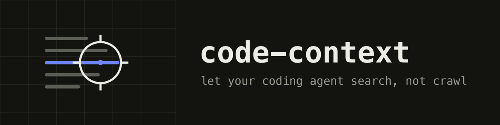
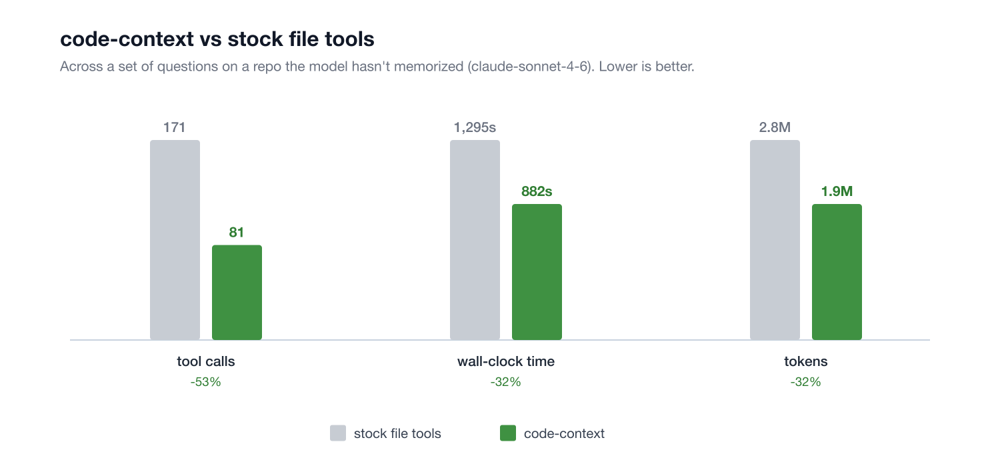
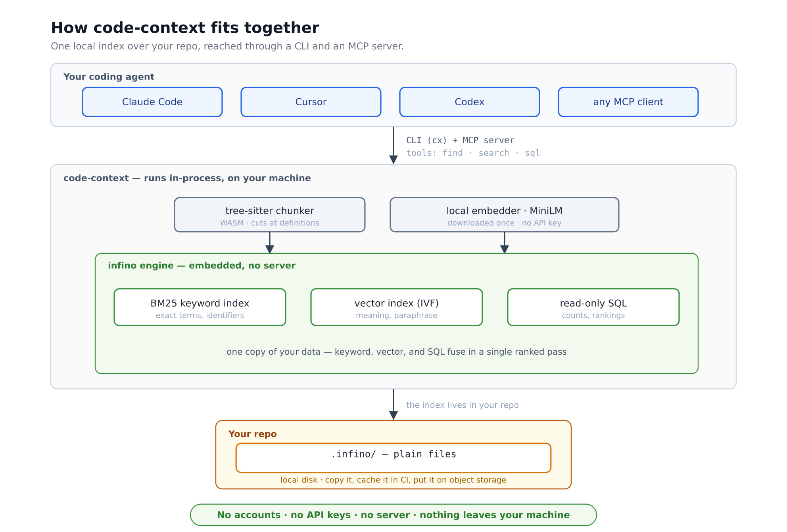

<div align="center">



[](https://github.com/infino-ai/code-context/actions/workflows/ci.yml)
[](https://www.npmjs.com/package/@infino-ai/code-context)
[](LICENSE)
[](https://nodejs.org/)
[](https://deepwiki.com/infino-ai/code-context)

</div>

**code-context** is the retrieval layer under your coding agent: one local
index over the whole repo (keyword, semantic, hybrid, and SQL), reached
through an MCP server and a CLI, with the index living in plain files inside
your repo. Your agent answers questions about the codebase without reading it
file by file.

The rule of thumb: the more a question spans the repo, the more this saves,
because the answer comes from a ranked index instead of pulling source into
context one file at a time.

**On your own codebase, ~30-40% fewer tokens and ~50% fewer tool calls**
(so answers land faster too - aggregation questions run about 2× quicker).
The harness is in the repo, so you can reproduce it on your own code.

**Try it live (early preview):** ask questions about any public GitHub repo
at [lantern.infino.ai](https://lantern.infino.ai), a demo agent that runs on
code-context.

- 🔎 **Find code by words or meaning.** One ranked pass fuses exact keyword
  matching with semantic similarity, and every hit carries the code with
  `path:line` citations.
- 📊 **Ask questions grep can't answer.** Search works as a SQL table
  function, so "which files have the most code about X" is one query:
  ranked by relevance, tallied by `GROUP BY`.
- ⚡ **Searching in seconds, fresh forever.** The keyword index commits
  before the embedding model even finishes downloading, vectors backfill in
  the background, and edits re-sync incrementally: only changed files
  re-chunk and re-embed.
- 🔒 **Nothing leaves your machine.** No accounts, no API keys, no database
  server, no telemetry. Embedding is a small local model, downloaded once;
  after that everything works offline. (The one opt-in exception is a
  [hosted index](#hosted-index-on-infino-platform) on infino-platform.)

Built on [infino](https://github.com/infino-ai/infino), a fast retrieval
engine that runs SQL, full-text search, and vector search over a single copy
of your data. Text and numeric data is stored as spec-compliant Parquet, and
the same engine handles logs, docs, and agent memory.


<sub>Claude Code answering questions about a repo through code-context: index it, then ask, and it reaches for search and SQL on its own.</sub>

## Quick start

Install the Claude Code plugin - nothing to paste into a config:

```
/plugin marketplace add infino-ai/code-context
/plugin install code-context@infino-ai
```

It registers code-context's three tools with `alwaysLoad` already set, so the
agent keeps them in view and reaches for the index directly instead of falling
back to plain file search.

Not on Claude Code, or prefer a one-line command? Add it as an MCP server:

```
claude mcp add-json code-context -s user '{"command":"npx","args":["-y","@infino-ai/code-context","mcp"],"alwaysLoad":true}'
```

The `alwaysLoad` flag pins this small tool set so that in a setup with many MCP
servers - where clients defer tool definitions behind a tool-search step - the
agent doesn't miss the index and fall back to plain file search. (Use *either*
the plugin or this command, not both.)

Then just ask a question about the code. The first `find`, `search`, or `sql`
on an unindexed repo builds the index inline and answers on the same call: keyword
search is live in seconds, and vectors backfill in the background. (Prefer to
kick it off yourself? `cx index` does the same build from a shell.)

CI-tested on Linux x64 (glibc) and macOS arm64; linux-arm64, musl, and
Windows-via-WSL are expected to work through the engine's prebuilt bindings
but are not CI-covered.

## Evaluation

Real agent runs over a codebase-Q&A suite (claude-sonnet-4-6, the same
minimal prompt for both lanes), on a repo the model has not memorized -
[infino](https://github.com/infino-ai/infino), the engine this is built on -
because that is the realistic case for your private code. Baseline is stock
file tools including Bash; the code-context lane is the same tools plus the
MCP server. Measured on three axes:



| Category | Tokens | Tool calls | Wall time |
|---|---|---|---|
| Aggregation ("most code about X") | **-43%** | **-71%** | **-48%** |
| Comprehension ("how does X work") | **-29%** | **-27%** | **-13%** |
| Blended | **-32%** | **-53%** | **-32%** |

Aggregation is the structural win - ranked search composed with `GROUP BY`,
which file tools cannot express at any budget - and it roughly halves
end-to-end time. These numbers are on a strong model; weaker, cheaper models
explore less efficiently, so the savings tend to be **larger** there. On
pinpoint symbol lookup, where a single grep is already cheap, an index
matches file tools rather than beating them.

Adding `find` was measured the same way, against the three-tool build on the
same repo, questions, model, and a blind judge: answer quality level (judge
29 / 22 / 13 main / find / tie over 64 pairs, no out-of-bounds citation in
128 answers), exact-lookup questions **-35% tokens, -17% dollars, -38% tool
calls**, the shipped question set flat (-3% tokens, +1% dollars), and about a
thousand tokens per turn of added prompt for the fourth tool.

The tool surface itself was then measured lever by lever - names, result
shapes, and every sentence of description - on two models with a blind
judge: the shipped text is the one that kept selection where it was, cut the
per-turn prompt cost of the tool definitions by more than half, and judged
51 to 33 over the previous surface. That run is also why there are three
tools and not four.

Full methodology and per-question tables are in
[docs/benchmark.md](docs/benchmark.md), with the harness in
[`bench/`](bench/) so you can run the same lanes on your own repo.

## What you get

One index and a deliberately small tool surface for agents:

| Tool | What it does | When agents use it |
|---|---|---|
| `find` | Every line containing an exact string, cited `path:line` like `grep -n`, plus matching lines per file like `grep -c`. Complete and unranked: the index's token match picks the candidate chunks, then each line is checked for the literal, so no file is scanned and every hit is a real occurrence. | Where an agent would grep: every use or definition of an identifier, an error message, a config key. |
| `search` | One ranked pass fusing exact keyword matching (BM25) with semantic similarity (reciprocal-rank fusion). Hits carry the chunk content, so answers come straight from results. | A strong default for finding and understanding code: how a subsystem works, code by meaning or exact term, context before a change, similar implementations - exact identifiers and paraphrases in the same call. |
| `sql` | Read-only SQL over the index, with the ranked search functions (`bm25_search`/`hybrid_search`) usable as table-valued relations. | Counts, rankings, aggregates over the whole repo in one query. |

Three tools, each a different question: where does this exact text occur,
what is most relevant to this, how much of what is where. Freshness is not
a tool: the first query on an unindexed repo builds the index, every query
re-syncs it against the working tree, and `cx index --full` rebuilds from a
shell. There are no near-duplicate retrieval tools, because those worsen an
agent's tool selection: `find` is unranked and complete where `search` is
ranked and top-k, and hybrid search's keyword half already ranks exact
identifier terms highly, so no separate lexical *ranking* tool exists.

### The SQL move

Search-as-a-table composes with aggregation. Ranked by relevance, tallied by
SQL, one engine pass:

```sql
SELECT path, SUM(end_line - start_line + 1) AS lines, COUNT(*) AS chunks
FROM bm25_search('chunks', 'content', 'vector index quantization', 300)
GROUP BY path ORDER BY lines DESC LIMIT 15
```

`hybrid_search(...)` and `vector_search(...)` work the same way. The CLI and
MCP server embed `{{name}}` placeholders server-side, so agents never handle
raw vectors.

### Staged readiness

`cx index` commits the keyword (BM25) index first. On a ~3,000-chunk repo
that takes under a second, so search works before any embedding model even
exists on the machine. Vectors backfill in the background with a local model
(downloaded once, no key; about two minutes for that same repo), and
hybrid/semantic ranking unlocks automatically when they land. If the vector
stage fails, keyword search stays live and the index says so honestly.

The default model optimizes quality-per-minute. See
[docs/embedder-eval.md](docs/embedder-eval.md) for how it was chosen.

### Your index is just files

Everything lives in `.infino/` in your repo root (added to your
`.gitignore` automatically on first index): plain files you can copy,
cache in CI, or put on object storage. It's a live index the engine queries in place, not a snapshot you
export and pass around.

## Hosted index on infino-platform

The same three tools can run over an index that lives in an
[infino-platform](https://infino.ai) database instead of on the machine. Point
any command at it with `--db`:

```bash
cx index --db https://api.platform.infino.ws/my-repo --api-key-file ~/.infino/key
cx mcp   --db https://api.platform.infino.ws/my-repo --api-key-file ~/.infino/key
```

`cx index --db` walks and chunks the repo here and loads the chunks table into
that database in one pass over the network. By default the platform embeds
the chunks and every query, so **no model runs on this machine** and there is
no vector backfill to wait for; `--embed-provider local` keeps this machine's
model and ships the vectors instead. Queries then go over HTTPS to the same
`find`, `search`, and `sql`, with the same results and the same `path:line`
citations; `.infino/` in the repo stays as a small sidecar (the manifest, the
file state, the usage ledger).

Two things change from the local index. A hosted table is shared, so nothing
builds or re-syncs it as a side effect of a query: loading is the explicit
`cx index --db` step, re-run to sync. And a fourth MCP tool is available when
you ask for it, `cx mcp --db ... --subagent`: `subagent` hands a question or
task in plain language to the platform's retrieval agent and returns the
facts it retrieved - rows with exact `path`, `start_line`, `end_line` and the
code, in the shape of `search` hits, plus aggregate rows and the SQL whose
rows answer the question - never a summary. The coding agent composes the
answer from the rows and cites them; `find` stays beside it for every
occurrence of an exact string.

Everything hosted is a command-line flag, on every command that can reach a
hosted database:

| Flag | Default | Purpose |
|---|---|---|
| `--db <url>` | (local index) | the hosted database, `https://host/<database>` (plain `http://` only for localhost) |
| `--api-key-file <path>` | `INFINO_API_KEY` | file holding the bearer key. The key is never an argument, since a process's arguments are visible to every other process on the machine; the environment variable is the one alternative |
| `--embed-provider <platform\|local>` | `platform` | who embeds the table at load time and the query at search time (the two must agree) |
| `--analyzer <ascii_lower\|standard>` | `ascii_lower` | `cx index` only: the full-text analyzer the table is created with. `ascii_lower` splits code identifiers on `.`, `_`, and `::`, which is what makes `find` complete on code |
| `--db-timeout-ms <n>` | 60000 | per-request timeout |
| `--cold-start-secs <n>` | 120 | how long to keep retrying while the database is not yet ready, before giving up |
| `--subagent` | off | `cx mcp` only: also register `subagent`; `--subagent-max-turns` (4) and `--subagent-max-wall-secs` (120) cap one call |

As an MCP server the flags go in `args`:

```json
{ "mcpServers": { "code-context": { "command": "npx", "args": ["-y", "@infino-ai/code-context", "mcp", "--db", "https://api.platform.infino.ws/my-repo", "--api-key-file", "/home/me/.infino/key"], "alwaysLoad": true } } }
```

## Setup for agents

code-context is an MCP server over stdio, so any MCP client works. Register
it once and the tools (`find`, `search`, `sql`) become available to the
agent.

<details>
<summary><strong>Claude Code</strong></summary>

**Install as a plugin** - `alwaysLoad` already set, nothing to paste into a
config:

```
/plugin marketplace add infino-ai/code-context
/plugin install code-context@infino-ai
```

**Or register it as an MCP server** directly:

```bash
claude mcp add-json code-context -s user '{"command":"npx","args":["-y","@infino-ai/code-context","mcp"],"alwaysLoad":true}'
```

`alwaysLoad: true` pins code-context's tools into context so the agent reaches
for the index directly. In sessions with many MCP servers Claude Code defers
tool definitions behind a tool-search step; without `alwaysLoad` the agent can
miss code-context and fall back to grep/read. It's a small, always-loaded set
(three tools). Omit it (or use the shorter `claude mcp add code-context -- npx
-y @infino-ai/code-context mcp`) if you'd rather leave the tools deferred.

Use *either* the plugin or the `add-json` command, not both. They register the
same `code-context` server, so running both just collides.

**For a team,** commit a project-scoped `.mcp.json` at the repo root so
everyone gets it (after the one-time project-server approval):

```json
{ "mcpServers": { "code-context": { "command": "npx", "args": ["-y", "@infino-ai/code-context", "mcp"], "alwaysLoad": true } } }
```

</details>

<details>
<summary><strong>Cursor</strong></summary>

Add to `.cursor/mcp.json`:

```json
{ "mcpServers": { "code-context": { "command": "npx", "args": ["-y", "@infino-ai/code-context", "mcp"] } } }
```

</details>

<details>
<summary><strong>Codex CLI</strong></summary>

In `~/.codex/config.toml` (note the key is `mcp_servers`):

```toml
[mcp_servers.code-context]
command = "npx"
args = ["-y", "@infino-ai/code-context", "mcp"]
```

</details>

<details>
<summary><strong>Gemini CLI</strong></summary>

In `~/.gemini/settings.json`:

```json
{ "mcpServers": { "code-context": { "command": "npx", "args": ["-y", "@infino-ai/code-context", "mcp"] } } }
```

</details>

<details>
<summary><strong>Windsurf, Cline, and other MCP clients</strong></summary>

Standard stdio MCP config:

```json
{ "mcpServers": { "code-context": { "command": "npx", "args": ["-y", "@infino-ai/code-context", "mcp"] } } }
```

Point the server at a repo explicitly with `env: { "CX_ROOT": "/path/to/repo" }`
when the client's working directory is not the repo.

</details>

Tools: `find`, `search`, `sql`. The server auto-syncs in the background as
queries arrive (an unchanged repo is a fast no-op), so results track your
edits without anyone asking; `cx index --full` from a shell forces a rebuild.

**Multiple repos in one session.** Each tool takes an optional `path` (an
absolute repo root). Omit it and the server uses its startup root; set it to
target a specific repo when a session spans more than one. One server
instance serves them all, each with its own index in its own `.infino/` -
no restart, no per-repo config.

## Configuration

| Variable | Default | Purpose |
|---|---|---|
| `CX_INDEX_DIR` | `<repo>/.infino` | where the index lives |
| `CX_SEARCH_K` | 10 | default number of hits `search` returns (also settable per call and via the CLI `-k` flag) |
| `CX_FIND_LIMIT` | 500 | default number of matching lines `find` returns, which is also the hard cap, so it only bites on a flood (also settable per call and via the CLI `--limit` flag); `total` and `byFile` are complete either way |
| `CX_MAX_FILES` / `CX_MAX_FILE_BYTES` | 20000 / 1MB | indexing caps (files over the file cap are left out; `find`/`search`/`sql` then flag the index as partial so an absence isn't read as proof) |
| `CX_ROOT` | current directory | default repo root for the MCP server / CLI when not run from the repo (each tool call can override it with a `path` argument) |
| `CX_AUTO_INDEX` | on | `0` makes a query on an unindexed repo error instead of building the index inline on the first `find`/`search`/`sql` |
| `CX_AUTO_SYNC` | on | `0` disables the MCP server's background staleness sync |
| `CX_SYNC_INTERVAL_SECS` | 30 | auto-sync debounce between staleness checks |
| `CX_NO_EMBED` | off | keyword-only mode for the MCP server (skip the vector stage) |
| `CX_NO_RECEIPT` | off | `1` turns off usage accounting - the per-call receipt on results and the `cx usage` ledger |

A hosted index is configured by command-line flags, not variables (see
[Hosted index](#hosted-index-on-infino-platform)); the only variable there is
`INFINO_API_KEY`, as the alternative to `--api-key-file`.

Every `find` / `search` / `sql` result carries a **usage receipt** - a terse, local line
showing the tokens it returned, the files it spanned, and a running session
total (e.g. `returned ~1.2k tokens | 4 chunks / 3 files | session ~8.4k over 7
queries`). Every figure is a `~` estimate, computed in-process - nothing about
your queries or code leaves the machine.

## CLI

The same index is reachable from the terminal too, for scripting, CI, or
inspecting results yourself. Install the binary, then run any command inside
a repo:

```
npm install -g @infino-ai/code-context
```

```
cx index [path]           sync the index (incremental; --full rebuilds, --watch follows edits)
cx find <text>            every line containing the exact text, path:line  (-i, -c per-file counts, --limit)
cx search <query>         exact terms + meaning, one ranked pass           (-k hits)
cx sql <statement>        read-only SQL; --embed q="text" fills {{q}}
cx status                 what the index holds, how fresh, vector readiness
cx usage                  ledger of queries run and what each returned  (-n, --all, --clear, --json)
cx mcp                    serve the MCP tools over stdio
cx <command> --db <url>   the same command over a hosted index on infino-platform  (--api-key-file, --embed-provider;
                          index: --analyzer; mcp: --subagent)
```

`cx usage` reads the local ledger at `.infino/usage.jsonl` - every `find` /
`search` / `sql` (from the CLI or the MCP server) appends one line recording the
query and a compact summary of what came back (`path:line` for find, paths and
line ranges for search, row count for sql), plus the token figures from the
receipt. It's a deterministic,
model-independent view of what went through the index - no running server or
agent needed to read it back. `CX_NO_RECEIPT=1` turns off both the inline
receipt and this ledger.

### How often does the agent actually reach for it?

`cx usage` can also show, per session, in how many of your prompts code-context
was used - e.g. `code-context used in 2 of 3 prompts (2 calls)`. The MCP server
can only count its own calls, not your prompts, so this ratio comes from two
Claude Code hooks that keep a local tally (nothing is sent anywhere). Add them
to your Claude Code settings (`~/.claude/settings.json` or a project
`.claude/settings.json`):

```json
{
  "hooks": {
    "UserPromptSubmit": [
      { "hooks": [{ "type": "command", "command": "cx usage --hook" }] }
    ],
    "PostToolUse": [
      { "matcher": "mcp__code-context.*", "hooks": [{ "type": "command", "command": "cx usage --hook" }] }
    ]
  }
}
```

`cx usage --hook` reads the event on stdin, updates `.infino/prompt-stats.json`,
and prints nothing. If you run code-context via `npx`, use
`npx -y @infino-ai/code-context usage --hook` as the command.

The same tally breaks the calls down by tool (`by tool: find 4 · search 2 ·
sql 1`) and records which tool the agent reached for first in each prompt
(`first tool of a prompt: find 4 · Grep 2`), which is what tells you whether
the tool surface steers as intended. With the matcher above only
code-context's own tools are forwarded, so the first-tool line names them
alone; set the `PostToolUse` matcher to `.*` to see Grep, Read, and the rest
in that line too, at the cost of one hook process per tool call.

## What it is, and what it isn't

code-context's lane is ranked **content** retrieval and content-relevance
aggregation: find code by words or meaning, rank whole files by how much
they're about a topic, always with `path:line` receipts. It deliberately
does **not** do structural code intelligence (call-graph tracing, dead-code
detection, type resolution). Tools that do are complementary: MCP servers
stack, so run both.

## Architecture



- **Chunking:** tree-sitter (WASM, no native compiles) cuts at definition
  boundaries for TypeScript/JS, Python, Rust, Go, Java, C/C++, Ruby, C#, PHP;
  Markdown splits at headings; everything else falls back to fixed windows.
  Every chunk carries `path, start_line, end_line, lang, content`.
- **Index:** [infino](https://github.com/infino-ai/infino) tables in
  `.infino/`: BM25 (FTS) and IVF vector indexes over a single copy of the
  data, queried in-process through the Node binding. No server. With
  `--db`, the same table lives in an infino-platform database and is
  reached over HTTPS instead, and `.infino/` is only a sidecar.
- **Embeddings:** local by default. A small model (chosen by a
  [measured eval](docs/embedder-eval.md)) downloaded once; no key, no
  per-query network, code never leaves the machine. Queries embed with the
  same model the index was built with, and a mismatch is a clear error, not
  silently wrong results. A hosted index is embedded by the platform unless
  told otherwise, so no model runs here at all.
- **Freshness:** incremental by design. A per-file state map (size/mtime
  prefilter, then content hash) means a sync re-chunks and re-embeds only
  the files that changed: on a ~3,000-chunk repo an unchanged tree checks
  in ~20ms and a one-file edit syncs in ~0.7s with vectors kept current
  (larger-repo numbers in the [benchmark](docs/benchmark.md)). The MCP
  server auto-syncs in the background as queries arrive (never blocking a
  query), `cx index` is incremental by default (`--full` to rebuild), and
  `cx index --watch` syncs on file events.

## Learn more

- [Code search for coding agents](docs/concepts/code-search-for-coding-agents.md) - the crawl-vs-retrieve model and when an index saves tokens.
- [FAQ](docs/faq.md) - what it is, when to use it, local-only guarantees, freshness.
- [Tradeoffs](docs/tradeoffs.md) - the honest limits.
- [Benchmark](docs/benchmark.md) - measured results, with a harness to reproduce them on your own repo.

## License

Apache-2.0
