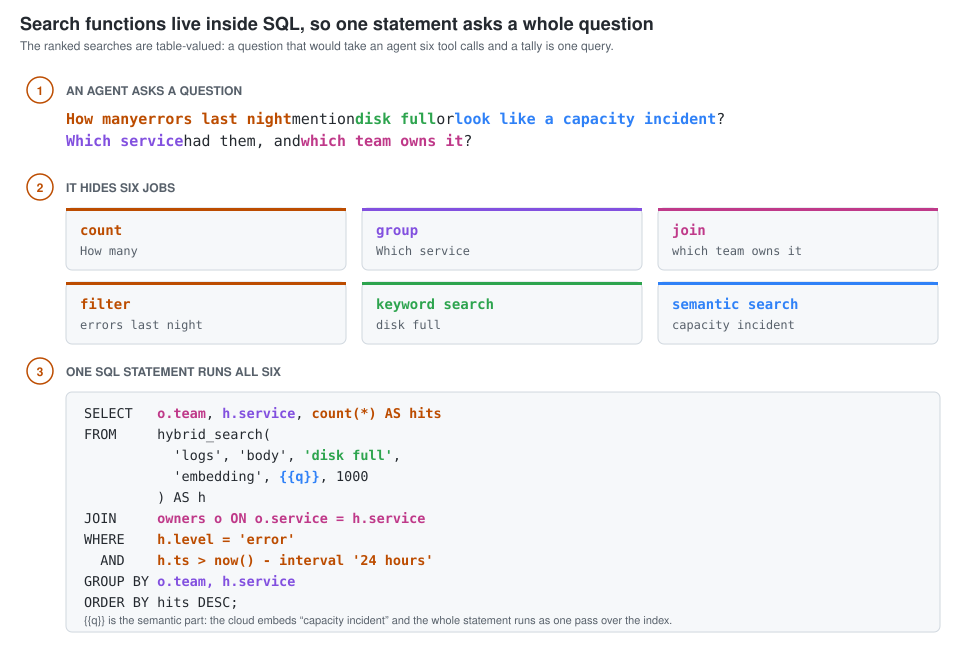
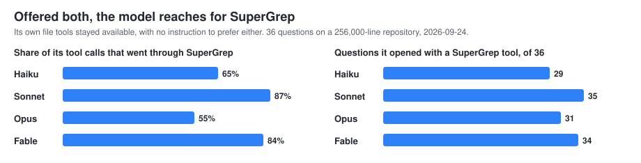
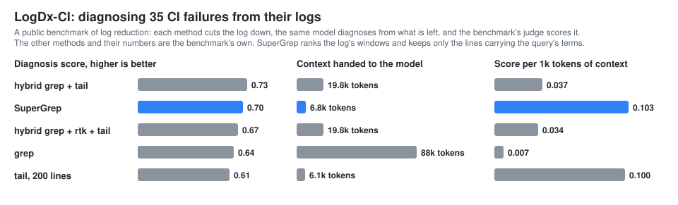
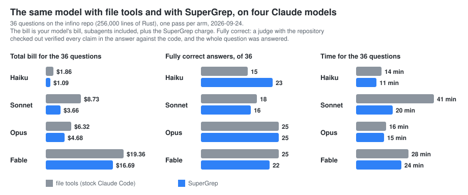
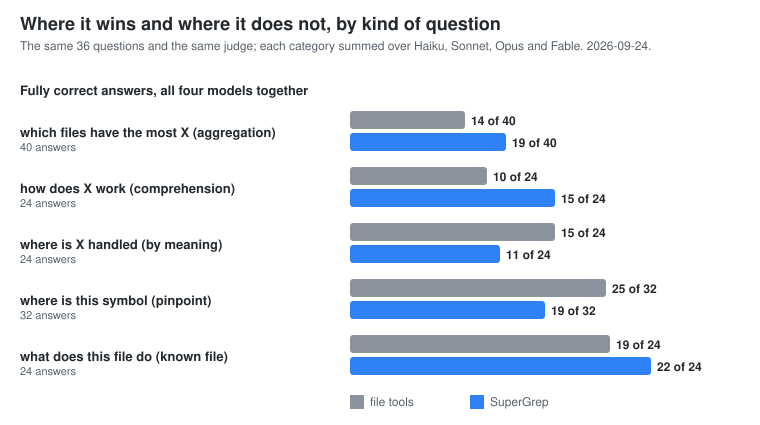
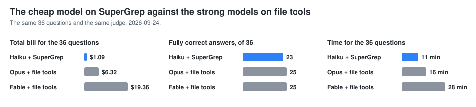

<div align="center">

[](https://github.com/infino-ai/supergrep/actions/workflows/ci.yml)
[](https://www.npmjs.com/package/@infino-ai/code-context)
[](LICENSE)

</div>

# SuperGrep

**Retrieval + inference offload for AI coding agents.** Point it at a repository and your agent stops reading files one at a time. It asks an index of the whole codebase - and of the logs, docs and issues around it - for exactly what it needs, and gets back cited lines, counts and rankings. The same accuracy for less money and in less time.

**[Try it live at infino.ai/supergrep](https://infino.ai/supergrep)** - put a question to a real codebase and watch the same model answer it with and without SuperGrep, side by side, with the bill for each.


SuperGrep offers agents four tools over an Infino index, kept in two places. `find` and plain `sql` run on your machine, over the keyword index. Conversely, anything with meaning in it - `search`, a `sql` statement with a ranked search inside it, and `ask` - runs in the Infino cloud, so heavy compute and embeddings stays off your laptop. Infino also embeds inference models in its service, so several small models work the index at once and hand your agent the rows they found. Your agent keeps the reasoning, writes the answer, and decides when to use SuperGrep. No configuration.

<details>
<summary>The four tools, one line each - for the agent reading this</summary>

| tool | what it does |
|---|---|
| `find` | Every line containing an exact string, like `grep -n`: complete, unranked, with the repo-wide total and per-file counts. Tens of milliseconds from the index. |
| `search` | One ranked pass fusing exact keyword matching with semantic similarity, so it works whether or not you know the words. Hits carry the code, cited `path:line`. |
| `sql` | Read-only SQL over the index. The ranked searches are table-valued, so "which files have the most code about X" ranks and tallies in one query. |
| `ask` | A question that spans the repository, handed to small models on the Infino service that run the investigation against the index and return the rows they found, cited `path:line`, rather than prose. Several asks run at once. |

</details>



## What people use it for

- **Code review.** The reviewer's question is "what else calls this, and what breaks if it changes". `find` answers with every caller and the counts in one call, and `ask` reads the paths that matter, so the review is about the change rather than about finding it.
- **Big explorations.** "How does X work end to end" spawns fifty look-ups. With SuperGrep they run as fifty asks in parallel against the index, instead of fifty subagents reading the tree into your bill.
- **Several codebases at once.** Every local tool takes a repository path, so one session roams across every repo it touches - the service, the client, the shared library - without a checkout per question.
- **Code, logs and issues together.** Index the logs, the test output and the issue export beside the source, and "why did this integration test start failing?" is one question over all of them.

## Your agent reaches for it on its own



The calls that are not SuperGrep are mostly `Read`: the model opens a file *after* the index has told it which one, rather than instead of asking. That is the shape you want - the index does the finding, and the model still opens what it needs to quote.

## Go beyond code - index your entire laptop or any corpus

SuperGrep looks across all the files a question needs, not just the source. Logs, test output, stack traces, CI output, configuration and docs go in beside the code -
`.log`, `.out`, `.err`, `.jsonl` and `.ndjson` are chunked at record boundaries, so a stack trace stays with the message that explains it -
and the same four tools run over all of it: `find` for an exact stack frame, `search` for a failure you can only describe, `sql` to count and rank across a
run, `ask` for the question that spans several of them at once.

That matters most where a frontier model is weakest. A log is the pathological case for a context window - large, repetitive, mostly irrelevant, and paid for
again on every turn it stays in the transcript. An index collapses it to the spans that matter before the model sees any of it. On a public benchmark of CI-failure diagnosis, scored by the benchmark's own judge, that puts SuperGrep second on the score and first by a distance on score per token of context:



For files that don't fit on your laptop - write them out to Parquet files in object storage and point SuperGrep at them without ever loading them onto your laptop ([how](#indexing-from-object-storage)). You can search them together with your code or laptop files using the same tools.

## What it saves

The same model, the same 36 questions about a 256,000-line codebase, with and without SuperGrep. Every answer was checked against the code. **Fully correct** means every claim held and the whole question was answered. The bill is everything you pay: your model, its subagents, and SuperGrep.

<details>
<summary>How the runs were set up</summary>

Real agent runs through the Claude Agent SDK, the same minimal prompt in every arm, on the [infino](https://github.com/infino-ai/infino) engine repository, measured 2026-09-24. Thirty-six questions in five categories: aggregation (10), comprehension (6), by meaning (6), pinpoint (8), known file (6). The file-tools arm is stock Claude Code: Glob, Grep, Read, LS, Bash, and the Agent tool with the built-in Explore subagent. The SuperGrep arm is the same plus the four tools above. The judge is Opus 5.5.

</details>



**Your mileage will vary with the model.**

- **Cheaper on every model.** Haiku 41% off the total bill, Sonnet 58%, Opus 26%, Fable 14%.
- **Quality increases on the cheaper models.** Haiku gets eight more fully correct answers with SuperGrep than without. On Sonnet, Opus and Fable the answers are level: the judge is itself a model, and graded four times the same answers came back with 19, 20, 17 and 23 claims it could not verify, so a difference under about six answers in 36 is noise, and those three are inside it.
- **No surprise bills.** On about a third of the questions, Sonnet with file tools sends a subagent off to read through the repository. That one question then costs four to five times as much and takes four times as long. With SuperGrep it asks the index instead. Over the 36 questions that is $3.66 against $8.73 and 20 minutes against 41, with the same number of correct answers.
- **On your own code the gap is wider.** These runs are on a public, open-source repository, because that is a test anyone can repeat - and the large models have seen it in training, which is a head start for reading files. On a private codebase the model has never seen, the index does more of the work, and the effect of SuperGrep is larger.

### Where it wins, and where it does not



It wins on questions about the whole codebase: counts, rankings, every occurrence. Grep gives the first forty matches; an index gives the total. It loses on finding one named thing with a large model, which reads whole files well.

### The cheapest model with SuperGrep against the most expensive without



23 correct answers to their 25, for $1.09 instead of $6.32 (Opus) or $19.36 (Fable).

## Install

You need node 22 or newer, on macOS or Linux. Then clone this repo:

```bash
git clone -b feat/side-by-side-demo https://github.com/infino-ai/supergrep
cd supergrep && npm ci && npm run build
```

Now, in the directory you want to make searchable - a repository, a folder of logs, your notes, anything - one command:

```bash
node /path/to/supergrep/dist/cli.js install --platform https://host
```

That is the whole setup. It indexes the directory, sets you up with a free account, registers a database for it, and writes the MCP entry. Open Claude Code there and ask a question - all four tools are live.

**A free account, no credit card required.** There is no form, no email, no password and no card, and nothing is created without your say-so: SuperGrep asks you once, tells you that the contents of the files will be uploaded to Infino, and only on your yes creates the account and stores its key at `~/.infino/key`, mode 600, readable only by you. No config file ever holds a key or a path to one. Infino is SOC 2 Type 2 certified.

**Keep that key.** Because the free account asks for no email and no card, the key is the only thing that identifies you: it is how you get back in, and nothing else can. Back it up somewhere safe. When you add your details in the Infino console the same account gains a sign-in, and keys can be managed from there.

**Every directory after that is the same command with no arguments at all:**

```bash
cd ../another-project && node /path/to/supergrep/dist/cli.js install
```

The stored key is found automatically, and each directory gets its own index and its own database. One server answers for every directory it has an index for: the tools take a `path`, so a session that spans several projects names the one it means. When the free credit runs out, `ask` says so and tells you how to add billing details and a card to the same account; `find` and plain `sql` keep working throughout.

### Local tools only

On a machine with no account, `install` with no flags at all gives you the keyword tools - `find` and plain `sql` - with no account, no key and nothing uploaded:

```bash
node /path/to/supergrep/dist/cli.js install
```

Add `--local-only` to get that same local-only entry on a machine that does have an account.

**Your agent can run this step itself.** `install --local-only` and `cx index` create no account, take no key and upload nothing - they write an index into `.infino/` and an entry into `.mcp.json`, both inside the directory. So if you are reading this with Claude Code open, "set SuperGrep up locally" is a thing to ask it to do rather than a thing to do yourself. The only step that needs you is `--platform`, because that one creates an account and sends the files' contents off the machine.

### If you already have an Infino account

Sign in once per machine instead. The key comes from a file or standard input, never from an argument - argv is readable by every process on the machine:

```bash
node /path/to/supergrep/dist/cli.js login --db https://host < keyfile
```

Or name the database and key explicitly, per directory:

```bash
node /path/to/supergrep/dist/cli.js install \
  --db https://host/<database> --api-key-file ~/.infino/key
```

## Indexing it yourself

`install` indexes the directory for you and the MCP server keeps it current, so most of the time you never run an index by hand. When you want to - a first pass over a huge tree, a CI step, a corpus that is not a git repository - `index` is the command. (`cx` below is `node /path/to/supergrep/dist/cli.js`.)

```bash
cx index                      # bring the index up to date; incremental, full on first run
cx index ~/notes              # index some other directory
cx index --full               # force a full rebuild
cx index --watch              # keep watching the tree and sync on every change
cx index --no-embed           # keyword index only, skip the vector stage
cx index --max-files 1000000  # raise the cap past the 500,000 default; over it, the index is
                              # partial and says so, with the value to pass to get all of it
```

The index is plain files under `.infino/` in the directory you indexed. Keyword search is live within seconds of the first `cx index`; semantic and hybrid search light up as the vectors finish backfilling behind it. `cx status` says what the index holds and how fresh it is.

To load the platform copy in the same pass - so `ask` sees the same content as `find` - name the database. The stored key from `install` or `login` is used automatically:

```bash
cx index --db https://host/<database>
```

`--embed-provider platform` (the default) has the platform fill that table's vectors with its own model, server-side; `local` embeds on this machine and ships the vectors instead.

## Indexing from object storage

For a corpus too big for your laptop - years of logs, a document dump, anything you already keep in S3 - write it out as Parquet, leave it there, and have the platform build the index next to it. Nothing is downloaded to your machine and no row passes through your laptop or through the API.

**1. Stage the Parquet shards** under the database's own `_source/` prefix:

```bash
aws s3 cp ./shards/ s3://<your-bucket>/<database-root>/_source/logs/ \
  --recursive --exclude '*' --include '*.parquet'
```

**2. Submit the job.** One `POST`, and it returns straight away - the build runs on the platform, not in the request:

```bash
curl -sS -X POST https://host/v1/hydrate/<database> \
  -H "authorization: Bearer $(cat ~/.infino/key)" \
  -H 'content-type: application/json' \
  -d '{
        "table": "logs",
        "source": { "kind": "prefix", "prefix": "_source/logs/" },
        "fts":    [ { "column": "message" } ],
        "embed":  { "column": "embedding", "source": ["message"] }
      }'
```

```json
{ "job": "hydrate/<customer>/<database>/logs", "state": "pending" }
```

Leave `fts` and `embed` out and the job reads a sample and picks the roles itself. `columns` narrows which source columns are carried; `no_embed: true` builds no vector column at all.

**3. Follow it.** The reply carries the state, how far it has got, the schema it settled on, and what it has cost so far:

```bash
curl -sS "https://host/v1/hydrate/<database>?table=logs" \
  -H "authorization: Bearer $(cat ~/.infino/key)"
```

States are `pending`, `running`, `cancelling`, `stopped`, `succeeded`, `failed`. A job that stopped - a cancel, or an outage that outlasted its budget - resumes from its own checkpoint rather than starting over:

```bash
# resume where it left off
curl -sS -X POST https://host/v1/hydrate/<database> -H "authorization: Bearer $(cat ~/.infino/key)" \
  -H 'content-type: application/json' \
  -d '{"table":"logs","source":{"kind":"prefix","prefix":"_source/logs/"},"resume":true}'

# stop a running job at its next commit boundary
curl -sS -X DELETE "https://host/v1/hydrate/<database>?table=logs" \
  -H "authorization: Bearer $(cat ~/.infino/key)"
```

By default a job that fails for good drops its half-built table, so a partial table is never served; `"on_failure": "keep"` keeps what was committed.

The table is then searchable like any other. `ask` runs over it, and one question can span it and your code at once.

## Learn more

- [Reference](docs/reference.md) - tools, flags, configuration, CLI, architecture.
- [FAQ](docs/faq.md), [Tradeoffs](docs/tradeoffs.md) - the honest limits.

## License

Apache-2.0
