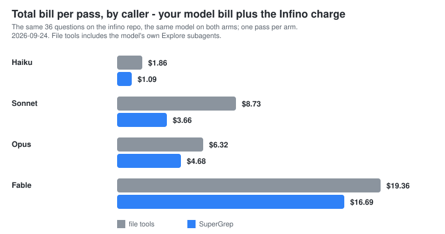
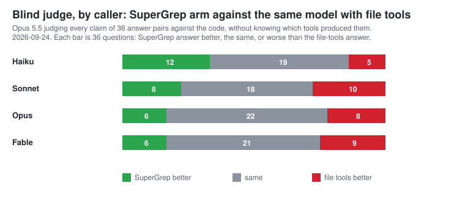

<div align="center">

[](https://github.com/infino-ai/code-context/actions/workflows/ci.yml)
[](https://www.npmjs.com/package/@infino-ai/code-context)
[](LICENSE)

</div>

# SuperGrep

**Retrieval for coding agents. The same answers, cheaper and faster, on every Claude model we measured.**

Much of what a coding agent spends time on is reading files rather than reasoning about them. SuperGrep gives the agent an index of the repository and four tools over it, so the lookup, the fan-out and the fifty "go look at this" jobs a hard task spawns run as retrieval instead of as reading. No config needed. Your model keeps the reasoning, writes the answer, and decides when to use them.


**Four tools. Three run on your machine, one runs in the cloud, over one
index kept in both places.**

| | tool | what it does |
|---|---|---|
| local | **`find`** | Every line containing an exact string, like `grep -n`, complete and unranked, with the repo-wide total and per-file counts. Tens of milliseconds from the index instead of a grep-and-read loop that pulls source into the model's context one file at a time. |
| local | **`search`** | One ranked pass fusing exact keyword matching with semantic similarity, so it works whether or not you know the words. Hits carry the code, cited `path:line`. |
| local | **`sql`** | Read-only SQL over the index. The ranked searches are table-valued relations, so "which files have the most code about X" is one query that ranks and tallies in a single pass. |
| cloud | **`ask`** | A question that spans the repository, handed to a small language model that runs the investigation against the same index with deep context from it. It comes back as the rows it found, cited `path:line`, rather than as prose. Several asks run at once. |

The models behind `ask` are small on purpose. Deciding where to look next in a 256,000-line repository is retrieval work, and a small model with deep
context from the index can do it at a fraction of the cost and fifty at a time. What it is not is a reasoning model: it executes search tasks and hands back rows, and your model writes the answer from them. That division was measured, and it is the one that wins.

### Sonnet chooses it on its own

When offered SuperGrep tools alongside its own file tools, **Sonnet chooses to use SuperGrep 76% of the time**, and
its first choice is always SuperGrep in every category of question:


It uses the whole surface rather than settling on one tool. Every call it made across the thirty-six questions, in order of how often:

| tool | calls | | tool | calls |
|---|---|---|---|---|
| **`find`** | 17 | | `Read` | 12 |
| **`ask`** | 14 | | `Glob` | 4 |
| **`sql`** | 11 | | `Grep` | 3 |
| **`search`** | 11 | | `Bash` | 1 |
| **`explore`** | 9 | | | |

That run was taken while a fifth tool, `explore`, was still offered; it has since been removed, because several asks issued together answered the same
questions faster and for less. Every SuperGrep tool is load-bearing, and the twenty calls that are not SuperGrep are mostly `Read`: it reads a file *after* the index has told it which one, rather than
instead of asking. That is the shape you want - the index does the finding, and the model still opens what it needs to quote.

## Go beyond code - index your entire laptop or any corpus

SuperGrep looks across all the files a question needs, not just the source. Logs, test output, stack traces, CI output, configuration and docs go in beside the code -
`.log`, `.out`, `.err`, `.jsonl` and `.ndjson` are chunked at record boundaries, so a stack trace stays with the message that explains it -
and the same four tools run over all of it: `find` for an exact stack frame, `search` for a failure you can only describe, `sql` to count and rank across a
run, `ask` for the question that spans several of them at once.

That matters most where a frontier model is weakest. A log is the pathological case for a context window - large, repetitive, mostly irrelevant, and paid for
again on every turn it stays in the transcript. An index collapses it to the spans that matter before the model sees any of it.

On a scale somebody else set: **LogDx-CI**, a public benchmark of 35 CI-failure diagnoses scored by the benchmark's own judge (2026-09-20). Ranking a log's windows and returning only the lines that carry the query's terms scored **0.70 on 6.8k tokens of context**. The benchmark's own grep definition scores 0.64 on 88k tokens; the published leader's hybrid grep-and-tail scores 0.67 on 19.8k, and its stronger variant 0.73 on the same 19.8k. First on score per token, second on raw score, to a method that spends nearly three times the context.

So "why did this integration test start failing?" is one question over source, recent logs, test output, stack traces and config - and the retrieval, the
fan-out and the fifty parallel investigations are the part that is farmed out.

For files that don't fit on your laptop - write them out to Parquet files in object storage and point SuperGrep at them without ever loading them onto your laptop ([how](#indexing-from-object-storage)). You can search them together with your code or laptop files using the same subagents.

## The numbers

Real agent runs through the Claude Agent SDK, the same minimal prompt in every arm, on the [infino](https://github.com/infino-ai/infino)
engine repository (about 256,000 lines of Rust the model has not memorized - which is what makes it a retrieval test at all: on a repository already in the
model's weights there is nothing for retrieval to do). Thirty-six questions in five categories - aggregation (10), comprehension (6), by meaning (6), pinpoint (8), known file (6) - each put to the same model twice, measured 2026-09-24 on four Claude models:

| arm | what the model has |
|---|---|
| file tools | Glob, Grep, Read, LS, Bash, and the Agent tool with Claude Code's built-in Explore subagent - stock Claude Code |
| SuperGrep | the same, plus the four tools above |

**How to read the tables.** A blind judge - Opus 5.5, with the repository checked out - checks every claim in each answer against the code, without knowing which tools produced it. A fixed rule turns what it found into a letter: **A**, every claim held and the whole question was answered; **B**, one claim could not be checked; **C**, part of the question was missed, or one claim was wrong; **F**, mostly wrong. "Ahead / tied / behind" counts the questions where the SuperGrep answer got a better, the same, or a worse letter. Cost is your total for the pass: your model's bill, subagents included, plus what the cloud tool charges.

| caller | letters, SuperGrep | letters, file tools | ahead / tied / behind | cost, SuperGrep | cost, file tools | median per question | p90 |
|---|---|---|---|---|---|---|---|
| Haiku | A 23, B 2, C 8, F 3 | A 15, B 1, C 19, F 1 | **12 / 19 / 5** | **$1.09** | $1.86 | 14 s vs 15 s | 36 s vs 42 s |
| Sonnet | A 16, B 1, C 19 | A 18, B 3, C 13, F 2 | 8 / 18 / 10 | **$3.66** | $8.73 | 22 s vs 25 s | **66 s vs 206 s** |
| Opus | A 25, B 1, C 10 | A 25, B 6, C 5 | 6 / 22 / 8 | **$4.68** | $6.32 | 18 s vs 22 s | 52 s vs 50 s |
| Fable | A 22, B 4, C 10 | A 25, B 5, C 6 | 6 / 21 / 9 | **$16.69** | $19.36 | 30 s vs 37 s | 85 s vs 96 s |





**Your mileage will vary with the model.** Three things held on every rerun since; the rest is the model's.

- **Cheaper on every caller.** Haiku 41% off the total bill, Sonnet 58%, Opus 26%, Fable 14%. The cloud tool's own charge is inside those totals.
- **The quality gain is on the cheap model.** Haiku gets eight more fully correct answers with SuperGrep than without, and is ahead on twelve questions to five behind. On Sonnet, Opus and Fable the letters are level: the judge is itself a model, and graded four times the same answers came back with 19, 20, 17 and 23 unverifiable claims, so a difference under about six questions in 36 is noise, and those three are inside it.
- **No runaway subagents.** Within a caller the medians are close. The gap is the tail, and the tail is Sonnet's: on about a third of questions Sonnet with file tools hands off to an Explore subagent that reads its way through the tree, at four to five times the cost and four times the time. Sonnet with SuperGrep answers the same question from one `ask` and a few `find`s - 2.4x cheaper and 2.1x faster over the panel, level on letters, with a p90 of 66 s against 206.

### Where it wins, and where it does not

By category, ahead / tied / behind against file tools:

| category (questions) | Haiku | Sonnet | Opus | Fable |
|---|---|---|---|---|
| aggregation - which files have the most X (10) | **7 / 2 / 1** | 2 / 5 / 3 | 1 / 7 / 2 | 2 / 4 / 4 |
| comprehension - how does X work (6) | 2 / 4 / 0 | 2 / 3 / 1 | 3 / 2 / 1 | 0 / 5 / 1 |
| by meaning - where is X handled (6) | 2 / 2 / 2 | 0 / 3 / 3 | 1 / 2 / 3 | 3 / 2 / 1 |
| pinpoint - where is this symbol (8) | 0 / 6 / 2 | 2 / 3 / 3 | 0 / 6 / 2 | 1 / 5 / 2 |
| known file - what does this file do (6) | 1 / 5 / 0 | 2 / 4 / 0 | 1 / 5 / 0 | 0 / 5 / 1 |

**Whole-corpus facts are where it is built to win.** Counts, rankings, every occurrence, sizes, patterns across many files: grep on a checkout gives the first forty matches and an index gives the total. Haiku with file tools walked 26 tool calls to break the crate down by module and got it wrong. After `sql` was taught to refuse a ranking built on a search's small top k, the ten aggregation questions were rerun on 2026-09-25: **Haiku 9 / 1 / 0, Sonnet 5 / 4 / 1, Opus 4 / 6 / 0**, with no question behind file tools on any of them.

**Where it loses, the other side is reading the files.** "Explain how X works end to end" and "find the code that does Y" are a tie or a loss on every model except Haiku: a strong model reading whole files does those well, and the Explore subagent built into the agent is designed for exactly that kind of question. Most of the wrong claims SuperGrep makes there say which code path calls which function. That gap is real; the tools to close it are `find` on the name, and the model has to reach for it.

### A cheap caller gets close to an expensive one

The comparison a buyer makes is not the same model with and without SuperGrep; it is the cheap model on the index against the strong model on file tools. The same 36 questions and the same judge:

| pair | ahead / tied / behind | A's of 36 | cost per pass | median per question |
|---|---|---|---|---|
| Haiku + SuperGrep vs Opus + file tools | 7 / 19 / 10 | 23 vs 25 | **$1.09 vs $6.32** | **14 s vs 22 s** |
| Haiku + SuperGrep vs Fable + file tools | 5 / 21 / 10 | 23 vs 25 | **$1.09 vs $19.36** | **14 s vs 37 s** |
| Opus + SuperGrep vs Opus + file tools | 6 / 22 / 8 | 25 vs 25 | **$4.68 vs $6.32** | 18 s vs 22 s |

Haiku on the index sits two A's under Opus on files, at a sixth of the cost and two thirds of the median time: the same letter on half the questions, a better one on one in five. Not "as good as" - and two of Haiku's three F's were the top-k shape `sql` now refuses.

## Install

You need node 22 or newer, on macOS or Linux. Then clone this repo:

```bash
git clone -b feat/side-by-side-demo https://github.com/infino-ai/code-context
cd code-context && npm ci && npm run build
```

Now, in the repository you want to search, one command:

```bash
node /path/to/code-context/dist/cli.js install --platform https://host
```

That is the whole setup. It indexes the repository, gets you a free account, registers this repository's database, and writes the MCP entry. Open Claude Code there and ask a question - all four tools are live.

**No signup.** There is no form, no email, no password and no card. SuperGrep asks you once - it tells you that the contents of the files are uploaded - and on yes it creates the account in the background and stores the key at `~/.infino/key`, mode 600, readable only by you. No config file ever holds a key or a path to one.

**Every repository after that is the same command with no arguments at all:**

```bash
cd ../another-repo && node /path/to/code-context/dist/cli.js install
```

The stored key is found automatically. When the free credit runs out, `ask` says so and tells you how to add billing details and a card to the same account; `find`, `search` and `sql` keep working throughout.

### Local tools only

On a machine with no account, `install` with no flags at all gives you `find`, `search` and `sql` - no account, no key, nothing uploaded:

```bash
node /path/to/code-context/dist/cli.js install
```

Add `--local-only` to get that same local-only entry on a machine that does have an account.

**Your agent can run this step itself.** `install --local-only` and `cx index` create no account, take no key and upload nothing - they write an index into `.infino/` and an entry into `.mcp.json`, both inside the repository. So if you are reading this with Claude Code open, "set SuperGrep up locally" is a thing to ask it to do rather than a thing to do yourself. The only step that needs you is `--platform`, because that one creates an account and sends the files' contents off the machine.

### If you already have an Infino account

Sign in once per machine instead. The key comes from a file or standard input, never from an argument - argv is readable by every process on the machine:

```bash
node /path/to/code-context/dist/cli.js login --db https://host < keyfile
```

Or name the database and key explicitly, per repository:

```bash
node /path/to/code-context/dist/cli.js install \
  --db https://host/<database> --api-key-file ~/.infino/key
```

**Before you point this at anything that matters:** sign in with your own account rather than staying on the anonymous trial key, and rotate the key afterwards. A trial key has no email behind it, so there is no way to recover or revoke it as yourself.

## Indexing it yourself

`install` indexes the repository for you and the MCP server keeps it current, so most of the time you never run an index by hand. When you want to - a first pass over a huge tree, a CI step, a corpus that is not a git repository - `index` is the command. (`cx` below is `node /path/to/code-context/dist/cli.js`.)

```bash
cx index                      # bring the index up to date; incremental, full on first run
cx index ~/notes              # index some other directory
cx index --full               # force a full rebuild
cx index --watch              # keep watching the tree and sync on every change
cx index --no-embed           # keyword index only, skip the vector stage
cx index --max-files 1000000  # raise the cap past the 500,000 default; over it, the index is
                              # partial and says so, with the value to pass to get all of it
```

The index is plain files under `.infino/` in the directory you indexed. Keyword search is live within seconds of the first `cx index`; semantic and hybrid search light up as the vectors finish backfilling behind it. `cx status` says what the index holds and how fresh it is.

To load the platform copy in the same pass - so `ask` sees the same content as `find` - name the database. The stored key from `install` or `login` is used automatically:

```bash
cx index --db https://host/<database>
```

`--embed-provider platform` (the default) has the platform fill that table's vectors with its own model, server-side; `local` embeds on this machine and ships the vectors instead.

## Indexing from object storage

For a corpus too big for your laptop - years of logs, a document dump, anything you already keep in S3 - write it out as Parquet, leave it there, and have the platform build the index next to it. Nothing is downloaded to your machine and no row passes through your laptop or through the API.

**1. Stage the Parquet shards** under the database's own `_source/` prefix:

```bash
aws s3 cp ./shards/ s3://<your-bucket>/<database-root>/_source/logs/ \
  --recursive --exclude '*' --include '*.parquet'
```

**2. Submit the job.** One `POST`, and it returns straight away - the build runs on the platform, not in the request:

```bash
curl -sS -X POST https://host/v1/hydrate/<database> \
  -H "authorization: Bearer $(cat ~/.infino/key)" \
  -H 'content-type: application/json' \
  -d '{
        "table": "logs",
        "source": { "kind": "prefix", "prefix": "_source/logs/" },
        "fts":    [ { "column": "message" } ],
        "embed":  { "column": "embedding", "source": ["message"] }
      }'
```

```json
{ "job": "hydrate/<customer>/<database>/logs", "state": "pending" }
```

Leave `fts` and `embed` out and the job reads a sample and picks the roles itself. `columns` narrows which source columns are carried; `no_embed: true` builds no vector column at all.

**3. Follow it.** The reply carries the state, how far it has got, the schema it settled on, and what it has cost so far:

```bash
curl -sS "https://host/v1/hydrate/<database>?table=logs" \
  -H "authorization: Bearer $(cat ~/.infino/key)"
```

States are `pending`, `running`, `cancelling`, `stopped`, `succeeded`, `failed`. A job that stopped - a cancel, or an outage that outlasted its budget - resumes from its own checkpoint rather than starting over:

```bash
# resume where it left off
curl -sS -X POST https://host/v1/hydrate/<database> -H "authorization: Bearer $(cat ~/.infino/key)" \
  -H 'content-type: application/json' \
  -d '{"table":"logs","source":{"kind":"prefix","prefix":"_source/logs/"},"resume":true}'

# stop a running job at its next commit boundary
curl -sS -X DELETE "https://host/v1/hydrate/<database>?table=logs" \
  -H "authorization: Bearer $(cat ~/.infino/key)"
```

By default a job that fails for good drops its half-built table, so a partial table is never served; `"on_failure": "keep"` keeps what was committed.

The table is then searchable like any other. `ask` runs over it, and one question can span it and your code at once.

## Learn more

- [Reference](docs/reference.md) - tools, flags, configuration, CLI, architecture.
- [FAQ](docs/faq.md), [Tradeoffs](docs/tradeoffs.md) - the honest limits.

## License

Apache-2.0
