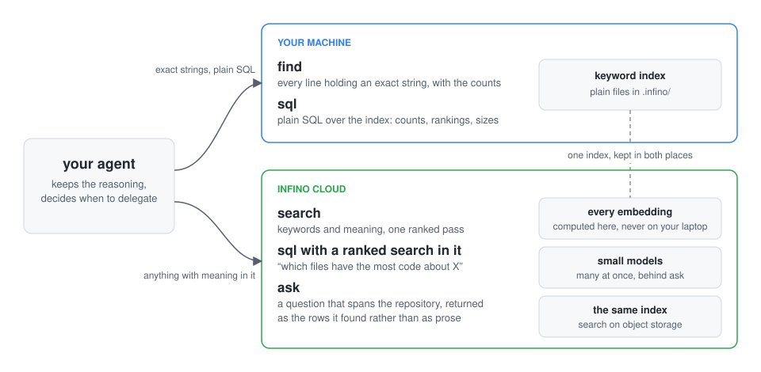
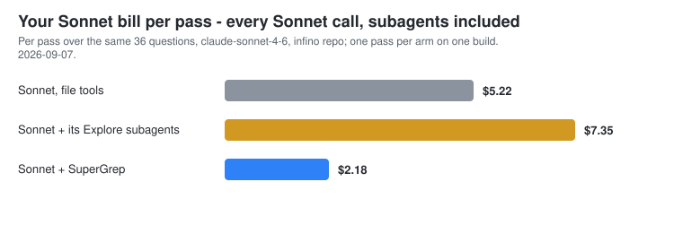
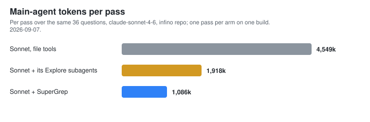
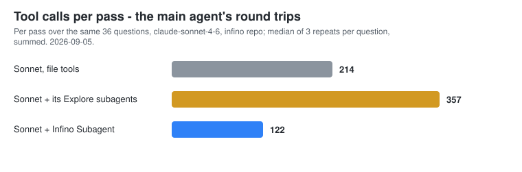
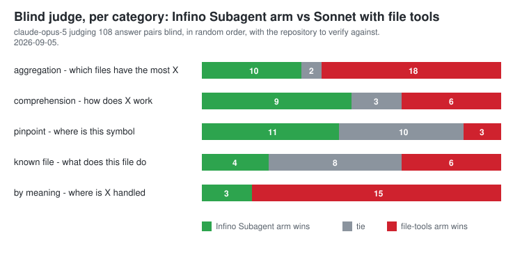
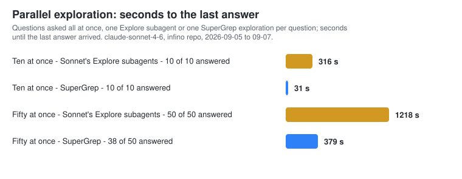

<div align="center">

[](https://github.com/infino-ai/code-context/actions/workflows/ci.yml)
[](https://www.npmjs.com/package/@infino-ai/code-context)
[](LICENSE)

</div>

# SuperGrep by Infino

**Small language models (SLMs) for fast code retrieval. Save 75% on your token bill.**

Your agent keeps the reasoning. SuperGrep takes the exploration off
it: the retrieval, the fan-out, the fifty "go look at this" jobs a hard task
spawns. Your agent decides when to call them:

- **`find` - local.** The repository is indexed on your machine, and exact
  lookups come back as `path:line` hits from the index, in tens of
  milliseconds, instead of a grep-and-read loop that pulls source into
  Claude's context one file at a time.
- **`explore` - cloud.** A question that spans the repository goes to
  Infino's platform, where the same index is kept and small language models
  run the investigation in parallel, with deep context from the index. What
  comes back is one grounded answer with the facts it rests on, cited
  `path:line`.



The models are small on purpose. A small model reading the right code beats
a large one deciding where to look next in a 256,000-line repository, at a
fraction of the cost and in parallel; the deep context is what makes its
answer hold. This is not a reasoning model. It is where Claude's
exploration, retrieval and fan-out go.

**Claude thinks. Infino explores.**

## The numbers

Real agent runs through the Claude Agent SDK: `claude-sonnet-4-6`, the same
minimal prompt in every arm, on the [infino](https://github.com/infino-ai/infino)
engine repository (about 256,000 lines of Rust the model has not memorized,
which is the realistic case for private code). Thirty-six questions in five
categories, each run three times per arm; per-pass figures are the median of
the three repeats per question, summed. Measured 2026-09-05; the harness,
the questions, the judge and the chart script are in [`bench/`](bench/).

| arm | what Sonnet has |
|---|---|
| Sonnet, file tools | Glob, Grep, Read, LS, Bash - stock Claude Code |
| Sonnet + its Explore subagents | the same, plus the Agent tool with Claude Code's built-in Explore subagent |
| Sonnet + Infino Subagent | the same, plus `find` and `explore` |

### Cost

| arm | cost per pass (every Sonnet call, subagents included) | main-agent tokens | tool calls (inside subagents included) |
|---|---|---|---|
| Sonnet, file tools | $4.62 | 3,344k | 214 |
| Sonnet + its Explore subagents | $8.20 | 1,309k | 357 |
| Sonnet + Infino Subagent | **$2.46** | 1,361k | **122** |







Against Sonnet's own Explore subagents: **3.3x lower Sonnet cost** at the
same main-agent context and a third of the tool calls. On the questions
that actually go to `explore` - how does X work, where is X handled - the
gap is **4.6x** ($1.16 against $5.33 per pass). Against plain file tools:
47% lower cost, 59% fewer main-agent tokens, 43% fewer tool calls.

Not in these figures: the platform's own model spend for `explore`, which
the platform meters and bills on its account.

### Quality

A blind judge - `claude-opus-5` with the repository checked out, both
answers in random order - picks a winner per pair and counts the claims in
each answer that the code does not support.

| category | pairs | Infino Subagent arm wins | ties | file-tools arm wins | unsupported claims, file tools / Infino |
|---|---|---|---|---|---|
| aggregation - which files have the most X | 30 | 10 | 2 | 18 | 50 / 90 |
| comprehension - how does X work | 18 | **9** | 3 | 6 | 12 / 16 |
| pinpoint - where is this symbol | 24 | **11** | 10 | 3 | 21 / 16 |
| known file - what does this file do | 18 | 4 | 8 | 6 | 9 / 9 |
| by meaning - where is X handled | 18 | 3 | 0 | 15 | 12 / 19 |
| all | 108 | 37 | 23 | 48 | 104 / 150 |



It wins comprehension and the exact lookups, and loses by meaning and
aggregation. Sonnet's own Explore subagents judged 40 / 35 / 33 against pure
Sonnet on the same pairs (wins / ties / losses).

### Parallel

Fifty questions asked at once, one exploration each:



Sonnet fanning out its own Explore subagents over the fifty (72 spawned):
50 of 50 in 1,218 s, $22.62. Infino Subagent: 38 of 50 in 379 s to the last
answer.

### Claude chooses it on its own

Nothing in the prompt names a tool. On exact-lookup questions Sonnet reached
for `find` before Grep in 17 of 24 runs; on every comprehension and
by-meaning question, 36 of 36 runs, its first move was `explore`.

## Install

Node 22 or newer, macOS or Linux. The platform tools are on this branch and
not yet in the npm release, so build from the branch:

```bash
git clone -b feat/platform-backend https://github.com/infino-ai/code-context
cd code-context && npm ci && npm run build
```

You need two things from whoever runs your Infino platform instance: a
**database URL** for the repository you want to index, `https://host/<database>`
(one database per repository), and a **bearer key**, which goes in a file
only you can read. Then register the server with Claude Code, with your
paths:

```bash
claude mcp add-json code-context -s user '{"command":"node","args":["/path/to/code-context/dist/cli.js","mcp","--db","https://host/<database>","--api-key-file","/path/to/key"],"alwaysLoad":true}'
```

Open Claude Code in the repository and ask a question. The first `find`
builds the local index inline and answers on the same call; the first
`explore` loads the platform copy. `alwaysLoad` keeps the tools in Claude's
view in sessions with many MCP servers.

Everything else - the five tools in detail, the platform flags, the
environment variables, the CLI, other MCP clients, the local-only mode the
npm release ships today - is in [docs/reference.md](docs/reference.md).

> The package, the CLI (`cx`) and the MCP server are still named
> `code-context`. Subagent is the product; the names underneath follow.

## Learn more

- [Reference](docs/reference.md) - tools, flags, configuration, CLI, architecture.
- [Benchmark](docs/benchmark.md) - the local index alone against stock tools, with the harness to reproduce it.
- [FAQ](docs/faq.md), [Tradeoffs](docs/tradeoffs.md) - the honest limits.

## License

Apache-2.0
